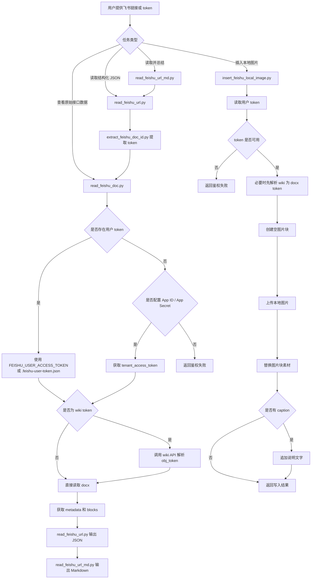

# feishu-doc-reader

一个面向 Codex 的飞书文档读写 skill。它用于读取飞书 `wiki` / `docx` 页面、输出结构化 JSON 或 Markdown 摘要，并支持把本地图片插入飞书文档。

## 能做什么

- 读取飞书文档正文
- 总结 wiki 或 docx 页面
- 比较两个飞书页面内容
- 抽取需求、接口说明、表格信息
- 将读取结果整理成 Markdown
- 向飞书 docx 文档末尾插入本地图片和说明文字

## 仓库结构

- `SKILL.md`: Codex skill 入口说明
- `scripts/feishu_auth.py`: 统一处理用户 token 读取逻辑
- `scripts/extract_feishu_doc_id.py`: 从飞书链接中提取 token
- `scripts/feishu_oauth_server.js`: 本地 OAuth 回调服务
- `scripts/read_feishu_doc.py`: 读取飞书文档原始接口数据
- `scripts/read_feishu_url.py`: 读取飞书链接并输出结构化 JSON
- `scripts/read_feishu_url_md.py`: 读取飞书链接并输出 Markdown
- `scripts/insert_feishu_local_image.py`: 上传本地图片并插入到飞书文档

## 依赖要求

- Python 3.10+
- Node.js 18+
- Python 包：`requests`

安装依赖：

```bash
python3 -m pip install requests
```

## 快速开始

首次使用推荐走这条最短路径：

1. 启动本地 OAuth 服务，完成一次授权。
2. 直接读取飞书链接并输出 Markdown。
3. 后续复用本地保存的 token，无需每次重复导出环境变量。

示例：

```bash
FEISHU_APP_ID="cli_xxx" \
FEISHU_APP_SECRET="xxx" \
node scripts/feishu_oauth_server.js
```

授权完成后，token 会保存到仓库根目录的 `.feishu-user-token.json`。

读取文档：

```bash
python3 scripts/read_feishu_url_md.py "https://xxx.feishu.cn/wiki/xxxxxxxx"
```

## 鉴权规则

脚本使用如下优先级获取访问凭证：

1. 如果环境中已有 `FEISHU_USER_ACCESS_TOKEN`，优先使用用户身份。
2. 如果未设置环境变量，自动读取仓库根目录的 `.feishu-user-token.json`。
3. 如果没有用户 token，但设置了 `FEISHU_APP_ID` 和 `FEISHU_APP_SECRET`，`read_feishu_doc.py` 会退回使用应用身份获取 `tenant_access_token`。

常用环境变量：

```bash
export FEISHU_USER_ACCESS_TOKEN="u-xxx"
export FEISHU_APP_ID="cli_xxx"
export FEISHU_APP_SECRET="xxx"
```

说明：

- 读取类脚本支持用户身份优先，底层原始读取脚本支持应用身份兜底。
- 插图脚本只接受用户 token，不会自动退回应用身份。
- `.feishu-user-token.json` 是本地敏感文件，已在 `.gitignore` 中忽略，不应提交到 Git。

## 获取用户 Token

在飞书开放平台配置 OAuth 回调地址后，启动本地服务：

```bash
FEISHU_APP_ID="cli_xxx" \
FEISHU_APP_SECRET="xxx" \
node scripts/feishu_oauth_server.js
```

默认回调地址是 `http://127.0.0.1:3333/callback`。

如果本地已经存在 `.feishu-user-token.json`，大多数读取和插图场景都可以直接复用，不需要再次授权。

## 常用命令

提取链接中的文档 token：

```bash
python3 scripts/extract_feishu_doc_id.py "https://xxx.feishu.cn/wiki/xxxxxxxx"
```

读取文档原始结构：

```bash
python3 scripts/read_feishu_doc.py "AtFwwJ3TwifgTpkbATOcYHQYnne"
```

读取飞书链接并输出结构化 JSON：

```bash
python3 scripts/read_feishu_url.py "https://xxx.feishu.cn/wiki/xxxxxxxx"
```

读取飞书链接并输出 Markdown：

```bash
python3 scripts/read_feishu_url_md.py "https://xxx.feishu.cn/wiki/xxxxxxxx"
```

向飞书文档插入本地图片：

```bash
python3 scripts/insert_feishu_local_image.py \
  "https://xxx.feishu.cn/docx/xxxxxxxx" \
  "/absolute/path/to/image.png"
```

插入图片并追加说明文字：

```bash
python3 scripts/insert_feishu_local_image.py \
  "https://xxx.feishu.cn/docx/xxxxxxxx" \
  "/absolute/path/to/image.png" \
  --caption "这里是图片说明"
```

## 工作流程图示例

下面这个 Mermaid 示例描述了这个 skill 的主要工作流程，包括读取、鉴权和插图三条主路径：



## 各脚本用途与输出

### `read_feishu_doc.py`

用于查看最原始的接口返回，适合调试权限、token 解析和块结构问题。

输入：

- `docx token`
- `wiki token`

输出：

- `token_source`
- `input_token`
- `resolved_wiki_node`
- `metadata`
- `blocks`

### `read_feishu_url.py`

面向结构化处理。它会先从链接提取 token，再自动调用底层读取逻辑，输出适合程序继续消费的 JSON。

输入：

- 飞书 `wiki` / `docx` / `docs` / `sheets` / `base` 链接

输出：

- `url`
- `title`
- `wiki_token`
- `doc_token`
- `token_source`
- `summary`
- `content_preview`

### `read_feishu_url_md.py`

面向分析、总结、需求整理等任务。它基于 `read_feishu_url.py` 的结果，转换成更适合直接阅读的 Markdown。

输出结构包括：

- 文档标题
- 文档信息
- 快速摘要
- 主要章节
- 结构统计
- 内容预览

### `insert_feishu_local_image.py`

用于把本地图片上传后插入到飞书 `docx` 文档末尾，可选追加一行说明文字。

输入：

- 飞书文档链接或 token
- 本地图片绝对路径
- 可选参数 `--caption`

输出：

- `doc_token`
- `block_id`
- `image_path`
- `file_token`
- `image_result`
- `caption_result`

## 使用建议

- 做需求分析、总结、摘录时，优先使用 `scripts/read_feishu_url_md.py`。
- 做结构化处理或调试下游程序时，优先使用 `scripts/read_feishu_url.py`。
- 只有需要看飞书原始接口结构时，再使用 `scripts/read_feishu_doc.py`。
- 如果输入是 `wiki` 链接或 `wiki token`，读取和插图脚本都会尽量解析成实际 `docx obj_token` 再继续处理。

## 已知限制

- 当前主要覆盖飞书 `docx` / `wiki` 场景。
- `extract_feishu_doc_id.py` 支持从 `wiki` / `docx` / `docs` / `sheets` / `base` 链接提取 token，但正文读取和插图能力主要围绕文档场景实现。
- 聊天中的图片附件不能稳定当作原始文件直接上传，插图时需要提供本地图片绝对路径。
- 应用身份和用户身份的可访问范围由飞书开放平台权限配置决定。
- 读取失败或写入失败时，应明确区分权限问题、token 问题、路径问题和文档类型问题。

## 发布建议

如果把这个目录作为独立仓库或压缩包发布，建议至少保留以下内容：

- `README.md`
- `SKILL.md`
- `scripts/`
- `.gitignore`

这样使用者就能直接理解 skill 的定位、鉴权方式和脚本入口。
